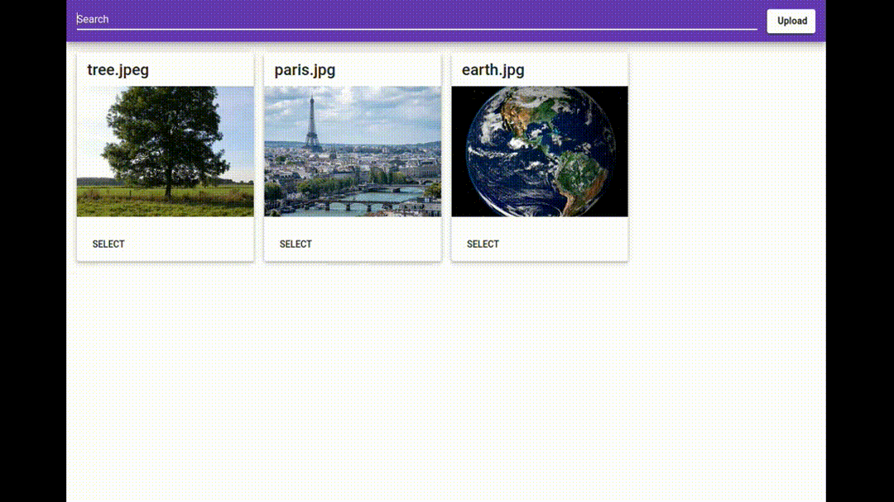

# Image Repository

This project is a full stack application that allows the user to upload an image to a repository and search the repository by image contents. The application uses Spring Boot, Angular and Postgresql in addition to the [Imagga] computer vision API to tag images based on their contents. 

## Uploading an Image:

## Searching for an Image by Image Contents:

[Imagga]: https://imagga.com/solutions/auto-tagging